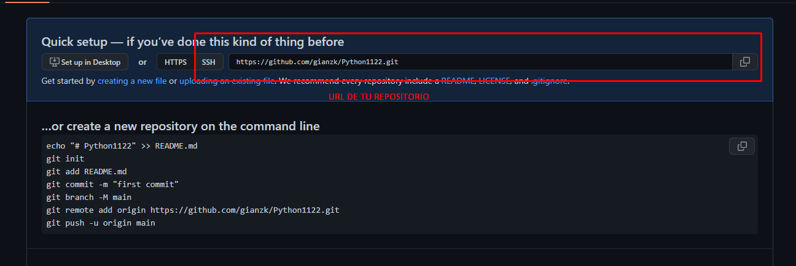

# GUIA 

## SUBIR PROYECTO A GITHUB
   ### Crear cuenta en github en  https://github.com/
    1. Crear cuenta
   
   
    2. Crear un nuevo repositorio 
   
   
*Opciones por default en crear nuevo repositorio(publico y no añadir el READEME file

   ### se visualizara el quick setup (el cuadro rojo es el link de tu repositorio)

   

   ### Instalar git https://git-scm.com/downloads
    3.Abrir git bash 
  

  `   git config --global user.name "username"`

   ` git config --global user.email "youremail@yourdomain.com"`
    
  ## verificar lista correcta

   ` git config --list`
    
    4. Crear proyecto y/o carpeta local
    
    5. Inicializar el repositorio

   `git init `

    6.conectar el repositorio local con github 

   `git branch -M main `

   `git remote add origin '${url de tu repositorio}'  `
   
    7. Agregar cambios
    
   `git add . `

    8. Confirmar cambios
    
  `git commit -m "mensaje que describa lo que has realizado " `
    
    9. Subir cambios
   ## primera vez que subimos un cambio
 `git  push -u origin main`
   ## luego para agregar mas cambios
   `git add . `

   `git commit -m "mensaje"`

   `git push ` 